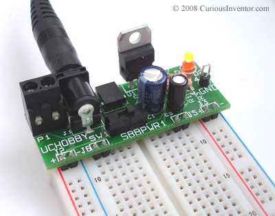
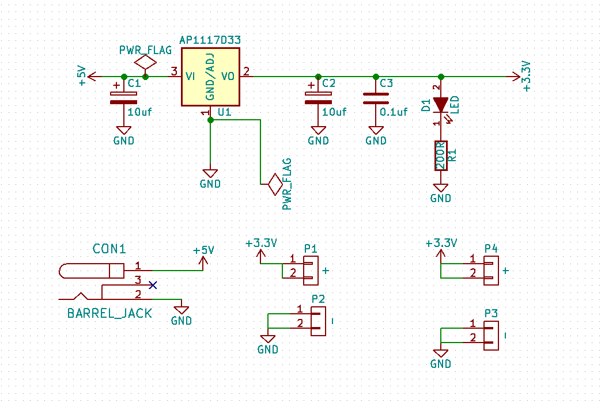
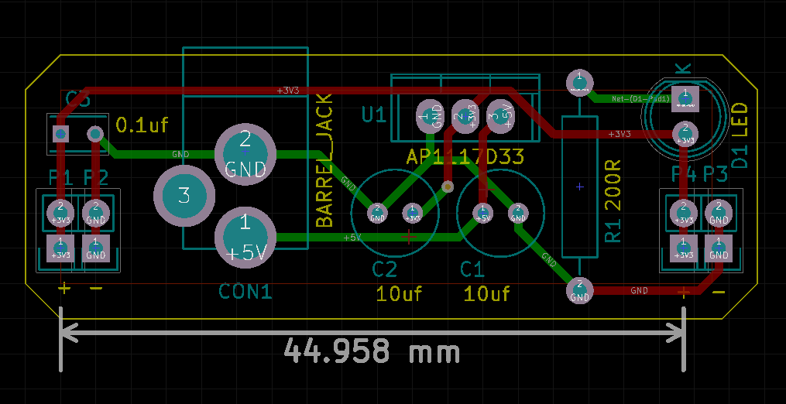

# KiCad workshop handout

Shortlink to this page: ven.nz/kicad-ws

The documentation for this workshop mostly consists of [youtube
screencasts](https://www.youtube.com/watch?v=Np3-4eBxWKM&index=2&list=PLmcDgdDpcaPjIBy60y22XzG036ckQI7bC). The
screencasts are deliberately fast, if you need them slower then click the video's settings button and choose a slower speed.

You are advised to watch the screencasts all the way through before starting,
then reference them as needed.

Each screencast has a clickable table of contents. Click the video's 'show more' link to expose it.

The screencasts show the creation of a simple LED board as a way of showing the
process. Don't just follow along - you will be making a breadboard power supply to supply either 3.3v or 5v.

# Drawing the Schematic

[Watch the schematic creation screencast](https://www.youtube.com/watch?v=v-qCI8wv72w&list=PLmcDgdDpcaPjIBy60y22XzG036ckQI7bC&index=1)

Your first task is to produce the schematic below.
If you want a 3.3v output use part AP1117D33. If you want 5v then use LM7805CT.

## Tips

* Don't bother naming components, that will happen automatically when you
 'annotate components'
* The regulator footprint is in the power_integrations library
* Use the hot keys below!

## Hot Keys

* ? - show hotkeys
* e - edit component
* m - move component (without wires)
* g - drag component (with wires)
* r - rotate
* a - add component
* del - delete component
* w - start a wire
* c - copy
* l - lable a wire (wires with the same label are joined)

## Adding a library

The barrel jack's PCB footprint will not be fabricated properly because
OSHPark's fab don't allow thin slots. You'll use a different footprint that uses
large holes instead.

Download the [barrel jack's modified footprint library](https://github.com/mattvenn/kicad/raw/master/breadboard-psu/barrel.zip)

Footprint libraries are a directory containing 1 or more footprint
files. The directory name ends in .pretty. The footprint files end in
.kicad_mod.

* open Eschema, run CvPCB to associate footprints
* preferences -> footprint libraries
* either project specific or global tab
* add the path to the library directory (ends in .pretty) ensure its type is kicad
* scroll down the list of libraries and click the new barrel library
* highlight the barrel jack component in the middle column and double click the
 new footprint on the right column.

# Create the PCB

[Watch the PCB creation screencast](https://www.youtube.com/watch?v=Np3-4eBxWKM&index=2&list=PLmcDgdDpcaPjIBy60y22XzG036ckQI7bC)

Example layout of the PCB:

## Tips

* Some operations are easier in default canvas (F9), others in OpenGL (F11)
* Use the hot keys below!

## Kot Keys

* ? - show hotkeys
* space - reset local co-ordinates
* F1 - zoom in
* F2 - zoom out
* m - move component (without wires)
* g - drag component (with wires)
* del - delete an object
* F11 - switch to openGL view (necessary for push'n'shove routing)
* e - routing options (only in openGL)
* x - start routing
* pg up - route on top layer
* pg down - route on bottom layer
* v - create via
* f - flip a component between top & bottom layers

# Fabrication

[Watch the fabrication screencast](https://www.youtube.com/watch?v=Np3-4eBxWKM&index=2&list=PLmcDgdDpcaPjIBy60y22XzG036ckQI7bC)

## Description of layers

* F.Cu - top copper layer used for electrical connections
* B.Cu - bottom copper layer (as above)
* F.SilkS - top silk screen used for component markings and orientation
* B.SilkS - bottom silk screen (as above)
* F.Mask - top mask used to cover the electrical connections with a nonconductive coloured layer
* B.Mask - bottom mask (as above)
* Edge.Cuts - where the board should be cut out

Each of these layers is exported as a separate file called a gerber.

You also need a drill file that specifies where all the holes are.
